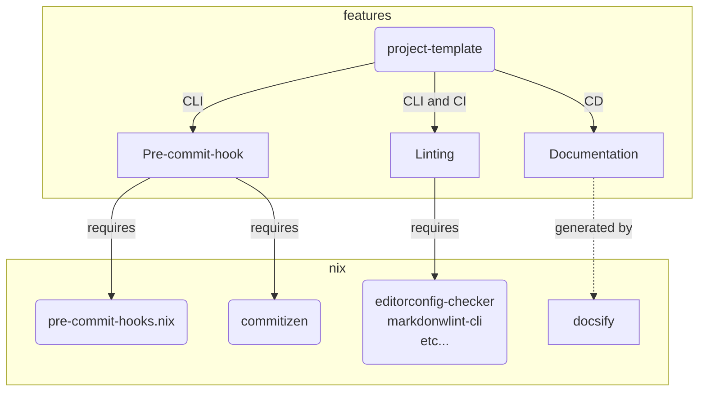

# project-template

<!-- editorconfig-checker-disable -->


<!-- editorconfig-checker-enable -->

Project Template for any programming development environment

## Prerequisite

* nix
* nix-direnv

## Usage

### Installation

1. Create new your own repo using this repo `Use this template`
1. Install nix
1. Setup initial settings below:

    ```bash
    # Setup nix environment
    direnv allow
    ```

### Merge project-template change into your branch

<https://qiita.com/doihei/items/223c273a1aef467fc3fd>

```bash
git remote add template http://github.com/Torimune29/project-template
git fetch --all
git merge template/main --allow-unrelated-histories
# Resolve conflicts...
```

## Features and Dependency Graph



## Directory Hierarchy

* Follow [Folder-Structure-Conventions](https://github.com/kriasoft/Folder-Structure-Conventions)

`$ tree --noreport` as bash
```bash
.
├── CHANGELOG.md
├── LICENSE
├── README.md
├── docs
│   ├── README.md
│   ├── index.html
│   └── template.md
├── flake.lock
├── flake.nix
└── tools
    ├── command-helper
    │   └── default.nix
    ├── commands
    │   └── default.nix
    └── pre-commit
        └── default.nix
```

## Custom command help

Use help command,
`$ help-commands` as bash
```bash
check
    description:
        check files using pre-commit
    example:
        $ check README.md LICENSE
check-all
    description:
        check all files using pre-commit
    example:
        $ check-all
sample
    description:
        (No description.)
    example:
        $ (No example.)

```

## Author

[Torimune29](https://github.com/Torimune29)

## License

```txt
// LICENSE

MIT License

Copyright (c) 2022 Torimune29

Permission is hereby granted, free of charge, to any person obtaining a copy
of this software and associated documentation files (the "Software"), to deal
in the Software without restriction, including without limitation the rights
to use, copy, modify, merge, publish, distribute, sublicense, and/or sell
copies of the Software, and to permit persons to whom the Software is
furnished to do so, subject to the following conditions:

The above copyright notice and this permission notice shall be included in all
copies or substantial portions of the Software.

THE SOFTWARE IS PROVIDED "AS IS", WITHOUT WARRANTY OF ANY KIND, EXPRESS OR
IMPLIED, INCLUDING BUT NOT LIMITED TO THE WARRANTIES OF MERCHANTABILITY,
FITNESS FOR A PARTICULAR PURPOSE AND NONINFRINGEMENT. IN NO EVENT SHALL THE
AUTHORS OR COPYRIGHT HOLDERS BE LIABLE FOR ANY CLAIM, DAMAGES OR OTHER
LIABILITY, WHETHER IN AN ACTION OF CONTRACT, TORT OR OTHERWISE, ARISING FROM,
OUT OF OR IN CONNECTION WITH THE SOFTWARE OR THE USE OR OTHER DEALINGS IN THE
SOFTWARE.
```
