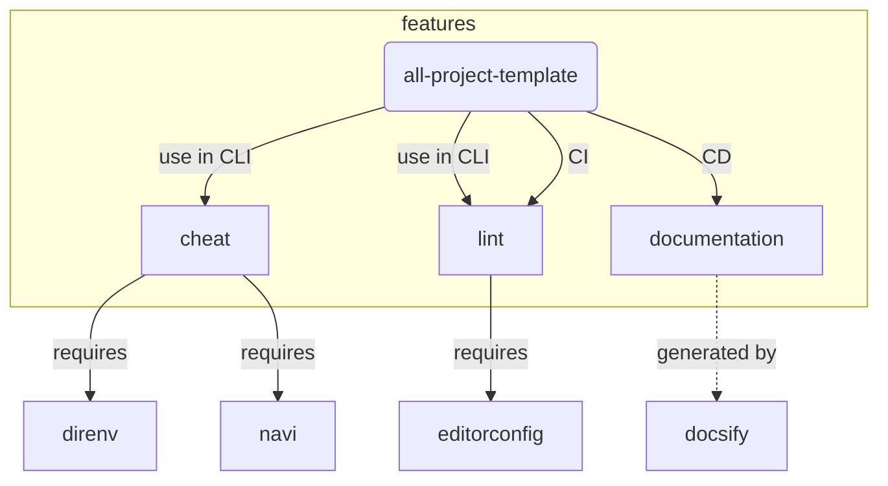

# all-project-template

## Directory Hierarcy

* Base: [Folder-Structure-Conventions](https://github.com/kriasoft/Folder-Structure-Conventions)
* Select:
    * docs (not doc)
    * tests (not test)

## Config

* [direnv](https://github.com/direnv/direnv): setting environment variables
    * Set environment variables into [.envrc](../.envrc)
        * For example, navi cheatsheat path, Git local config, etc

    ```bash
    # .envrc
    
    export NAVI_PATH="tools/cheats:$NAVI_PATH"
    
    # export GIT_AUTHOR_NAME=
    # export GIT_AUTHOR_EMAIL=
    
    
    ```

    * Execute `direnv allow` on bash to allow .envrc
* [navi](https://github.com/denisidoro/navi): cheating commands
    * Set Project-specified cheatsheet into [cheats directory](../tools/cheats/)
    * Execute `navi` with `NAVI_PATH=(project-root)/tools/cheats` to load above
        * Recommend: set environment on [.envrc](../.envrc)

    ```bash
    # .envrc#L1-L2
    
    export NAVI_PATH="tools/cheats:$NAVI_PATH"
    
    ```

    ```bash
    # tools/cheats/sample.cheat
    
    % sample
    
    # sample echo string
    echo <string>
    
    # sample echo yes or no
    echo <yesno>
    $ yesno: echo 'yes no what?' | tr ' ' '\n'
    
    ```

* [editorconfig](https://editorconfig.org/): maintaining coding style
    * Set Project-specified style into [.editorconfig](../.editorconfig)
    <!-- editorconfig-checker-disable -->
    ```bash
    # .editorconfig#L1-L14
    
   
    ```
    <!-- editorconfig-checker-enable -->

    * Add editorconfig extension in editor
* [Codacy](https://www.codacy.com/)
    * Set Project-specified directory into [./codacy.yml](../.codacy.yml)
    <!-- editorconfig-checker-disable -->
    ```yaml
    # .codacy.yml
    
    exclude_paths:
      - ".*/**"
      - "build/**"
      - "docs/**"
      - "tests/**"
      - "tools/**"
    
    ```
    <!-- editorconfig-checker-enable -->

    * Add repository in Codacy

## Dependency Graph



## Author

[Torimune29](https://github.com/Torimune29)

## License

```txt
// LICENSE

```
