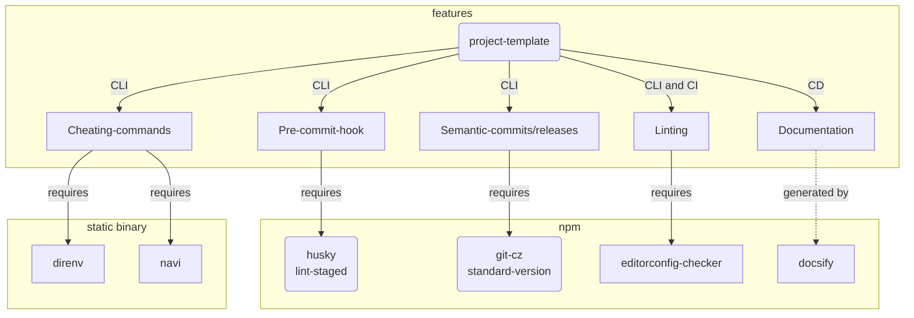

# project-template

## Prerequisite

* npm
* direnv(Optional)
* navi(Optional)

## Installation

1. Create new your own repo using this repo "Use this template"
1. Setup inital settings below:

    ```bash
    # Install node_modules
    npm install
    # Setup pre-commit using husky, lint-staged
    npx husky install
    npx husky add .husky/pre-commit "\"$(npm bin)\"/lint-staged"
    # Optional: if you have direnv, setup user environment
    diernv allow
    ```

1. Develop

## Features and Dependency Graph



## Directory Hierarcy

* Follow [Folder-Structure-Conventions](https://github.com/kriasoft/Folder-Structure-Conventions)
* Select:
    * docs (not doc)
    * tests (not test)

## Config

* [husky](https://github.com/typicode/husky): setting Git pre-commit
    * Set extra pre-commit scripts into .husky/pre-commit

* [lint-staged](https://github.com/okonet/lint-staged): setting auto lint on staging
    * Set extra lint method into [package.json](./package.json)

    <!-- editorconfig-checker-disable -->
    ```json5
    // package.json#L15-L18
    
    },
    "lint-staged": {
      "*.*": [
        "editorconfig-checker"
    ```
    <!-- editorconfig-checker-enable -->

* [direnv](https://github.com/direnv/direnv): setting environment variables
    * Set environment variables into [.envrc](../.envrc)
        * For example, navi cheatsheat path, Git local config, etc

    ```bash
    # .envrc
    
    export NAVI_PATH="tools/cheats:$NAVI_PATH"
    alias gc="git-cz"
    
    # export GIT_AUTHOR_NAME=
    # export GIT_AUTHOR_EMAIL=
    
    
    ```

    * Execute `direnv allow` on bash to allow .envrc
* [navi](https://github.com/denisidoro/navi): cheating commands
    * Set Project-specified cheatsheet into [cheats directory](../tools/cheats/)
    * Execute `navi` with `NAVI_PATH=(project-root)/tools/cheats` to load above
        * Recommend: set environment on [.envrc](../.envrc)

    ```bash
    # .envrc#L1-L2
    
    export NAVI_PATH="tools/cheats:$NAVI_PATH"
    alias gc="git-cz"
    ```

    ```bash
    # tools/cheats/sample.cheat
    
    % sample
    
    # sample echo string
    echo <string>
    
    # sample echo yes or no
    echo <yesno>
    $ yesno: echo 'yes no what?' | tr ' ' '\n'
    
    ```

* [editorconfig](https://editorconfig.org/): maintaining coding style
    * Set Project-specified style into [.editorconfig](../.editorconfig)
    <!-- editorconfig-checker-disable -->
    ```bash
    # .editorconfig#L1-L14
    
    # http://editorconfig.org
    # base: google coding style
    
    root = true
    
    [*]
    charset = utf-8
    end_of_line = lf
    indent_style = space
    indent_size = 2
    insert_final_newline = true
    trim_trailing_whitespace = true
    
    # document
    ```
    <!-- editorconfig-checker-enable -->

    * Add editorconfig extension in editor
* [Codacy](https://www.codacy.com/)
    * Set Project-specified directory into [./codacy.yml](../.codacy.yml)
    <!-- editorconfig-checker-disable -->
    ```yaml
    # .codacy.yml
    
    exclude_paths:
      - ".*/**"
      - "build/**"
      - "docs/**"
      - "tests/**"
      - "tools/**"
    
    ```
    <!-- editorconfig-checker-enable -->

    * Add repository in Codacy

## Author

[Torimune29](https://github.com/Torimune29)

## License

```txt
// LICENSE

MIT License

Copyright (c) 2022 Torimune29

Permission is hereby granted, free of charge, to any person obtaining a copy
of this software and associated documentation files (the "Software"), to deal
in the Software without restriction, including without limitation the rights
to use, copy, modify, merge, publish, distribute, sublicense, and/or sell
copies of the Software, and to permit persons to whom the Software is
furnished to do so, subject to the following conditions:

The above copyright notice and this permission notice shall be included in all
copies or substantial portions of the Software.

THE SOFTWARE IS PROVIDED "AS IS", WITHOUT WARRANTY OF ANY KIND, EXPRESS OR
IMPLIED, INCLUDING BUT NOT LIMITED TO THE WARRANTIES OF MERCHANTABILITY,
FITNESS FOR A PARTICULAR PURPOSE AND NONINFRINGEMENT. IN NO EVENT SHALL THE
AUTHORS OR COPYRIGHT HOLDERS BE LIABLE FOR ANY CLAIM, DAMAGES OR OTHER
LIABILITY, WHETHER IN AN ACTION OF CONTRACT, TORT OR OTHERWISE, ARISING FROM,
OUT OF OR IN CONNECTION WITH THE SOFTWARE OR THE USE OR OTHER DEALINGS IN THE
SOFTWARE.
```
